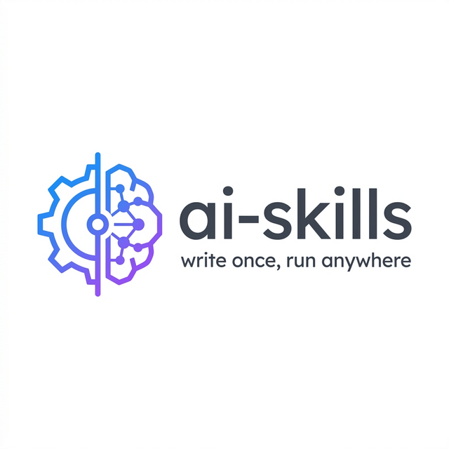

<p align="center">
  
</p>

# 🧠 ai-skills

> The universal open standard for AI agent skills — write once, run anywhere.

[](https://opensource.org/licenses/MIT)
[](./docs/SPEC.md)
[](./CONTRIBUTING.md)

---

## The Problem

AI agent frameworks are exploding — LangChain, AutoGen, CrewAI, Semantic Kernel, and dozens more. But skills (tools, functions, actions) built for one framework **don't work in another**. Every developer rewrites the same skills over and over, just in different formats.

This is the same problem the web solved with HTML. We need a common language for AI skills.

## The Solution

**ai-skills** is an open specification + SDK that lets you:

1. **Write** a skill once in a simple `skill.yaml` file
2. **Publish** it to the public registry
3. **Export** it to any framework automatically

```
skill.yaml  →  LangChain tool
            →  AutoGen skill  
            →  CrewAI tool
            →  Semantic Kernel function
            →  Raw API call
```

### How This Compares
Wondering how this compares to **LangChain Tools**, **OpenAPI**, **MCP**, or **SKILL.md**? 
Read our detailed breakdown: **[How ai-skills Compares](./docs/COMPARISON.md)**.

---

## Quick Start

### Install the CLI

```bash
pip install ai-skills-sdk
```

### Create your first skill

```bash
aiskills init my-skill
cd my-skill
```

This creates a `skill.yaml`:

```yaml
skill:
  id: my-skill
  version: 1.0.0
  name: My Skill
  description: What this skill does
  inputs:
    - name: input_text
      type: string
      required: true
  outputs:
    - name: result
      type: string
  execution:
    type: prompt
    prompt_template: "Do something with: {input_text}"
```

### Validate and audit

```bash
# Check against the v0.1 schema specification
aiskills validate skill.yaml

# Run static security analysis (catch secrets & dangerous imports)
aiskills validate --audit skill.yaml
```

### Export to your framework

```bash
aiskills export --target langchain    # → langchain_tool.py
aiskills export --target autogen      # → autogen_skill.py
aiskills export --target crewai       # → crewai_tool.py
```

### Run a skill locally

```bash
# Dry-run: shows formatted prompt without calling any API
aiskills run skill.yaml --input '{"text": "hello"}'

# Run a code-type skill (no API key needed)
aiskills run examples/word-frequency/skill.yaml --input-file input.json

# Live execution: actually calls the LLM (requires OPENAI_API_KEY)
aiskills run skill.yaml --input-file input.json --execute
```

### Publish to the registry

```bash
# Optional: override the default hosted registry for this shell
export AISKILLS_REGISTRY_URL=https://ai-skills-production-f4f0.up.railway.app

# Authenticate via GitHub OAuth
aiskills login

# Publish your skill to the registry
aiskills publish skill.yaml
```

### Install a skill

```bash
# Optional: override the default hosted registry for this shell
export AISKILLS_REGISTRY_URL=https://ai-skills-production-f4f0.up.railway.app

# Download a published skill to your local workspace
aiskills install ai-skills-team/summarize-document

# Download and immediately auto-export it to LangChain!
aiskills install ai-skills-team/summarize-document --export langchain
```

### Use the registry web app (MVP)

```bash
cd registry/frontend
npm install
npm run dev
```

Then open `http://localhost:3000`:
- `/` — marketing + discovery homepage
- `/skills` — browse/search with filters and pagination
- `/skills/{author}/{id}` — full skill detail page
- `/publish` — publishing guide

---

## Project Structure

```
ai-skills/
├── README.md               ← You are here
├── CONTRIBUTING.md         ← Contribution guidelines
├── CODE_OF_CONDUCT.md      ← Community standards
├── .github/
│   ├── workflows/ci.yml    ← CI: validate all skills on push/PR
│   ├── ISSUE_TEMPLATE/     ← Bug, feature, new skill templates
│   └── pull_request_template.md
├── docs/
│   ├── SPEC.md             ← The official v0.1 specification
│   ├── SECURITY.md         ← Security model and audit tools
│   └── COMPARISON.md       ← How we compare to MCP/LangChain/etc
├── examples/               ← 19 complete, working example skills (prompt, code, tool_call, chain)
│   ├── summarize-document/
│   ├── generate-sql/ 
│   ├── markdown-to-html/
│   └── ... (16 more)
├── sdk/
│   ├── cli.py              ← Main CLI entry point
│   ├── validator.py        ← Schema validation
│   ├── security.py         ← Security auditing
│   ├── runner.py           ← Skill execution engine (run command)
│   ├── auth_config.py      ← Authentication management
│   └── exporters/          ← Framework adapters
└── registry/
    ├── api/                ← FastAPI Registry Backend Server
    ├── frontend/           ← Next.js registry web app (homepage, browse, detail, publish)
    └── index.json          ← Prototype registry index
```

---

## Skill Types

| Type | Description | Example |
|------|-------------|---------|
| `prompt` | LLM prompt template | Summarize, classify, translate |
| `tool_call` | External API/function call | Web search, database query |
| `chain` | Multiple steps in sequence | Research → summarize → format |
| `code` | Execute a code snippet | Data processing, calculations |

---

## Why ai-skills?

| | ai-skills | LangChain | AutoGen | Semantic Kernel |
|--|-----------|-----------|---------|-----------------|
| Framework-agnostic | ✅ | ❌ | ❌ | ❌ |
| Open standard | ✅ | ❌ | ❌ | ❌ |
| Public registry | ✅ | ❌ | ❌ | ❌ |
| Built-in benchmarks | ✅ | ❌ | ❌ | ❌ |
| Skill portability | ✅ | ❌ | ❌ | ❌ |

---

## Contributing

We're in early days — contributions, feedback, and ideas are very welcome.

- 📖 Read the [Specification](./docs/SPEC.md)
- 🛠️ Check out [example skills](./examples/)
- 💬 Open an issue to discuss ideas
- 🔁 Submit a PR

---

## License

MIT — free to use, modify, and distribute.

---

## Session Update — 2026-03-26

GitHub OAuth implementation for the registry was completed in this session across the backend, frontend, and CLI. The backend now uses signed JWTs with proper verification, GitHub OAuth state validation, frontend callback redirects, stateless logout, and user email plus last-login persistence. The frontend now includes `/login`, `/auth/callback`, an auth context/provider, and dynamic signed-in header state. The CLI `aiskills login` flow was updated to complete browser-based auth without manual token paste, and `registry/api/.env.example` was added with the required auth variables.

## Session Update — 2026-03-27

The hosted registry configuration was tightened up in this session. The backend GitHub OAuth callback URL is now built from `BASE_URL`, so production callbacks point back to the backend itself instead of the frontend. The API docs and example env file were updated with `BASE_URL`, the backend CORS allowlist now includes `https://ai-skills-omega.vercel.app`, and the CLI registry commands now honor `AISKILLS_REGISTRY_URL` with a default fallback of `https://ai-skills-production-f4f0.up.railway.app`.

## Session Update — 2026-03-27 (Production Hardening)

A comprehensive production audit was run and 10 issues were fixed: insecure default secrets removed (now required fields), `debug` defaults to `False`, CORS origins simplified to `settings.frontend_url`, OAuth state moved from in-memory dict to a persistent DB table (`OAuthState`), `getattr` removed from the code sandbox, deprecated `@app.on_event("startup")` replaced with modern `lifespan`, health check no longer exposes `environment` in production, duplicate `DEFAULT_REGISTRY_URL` import consolidated, and `.env.example` updated with all production variables.
